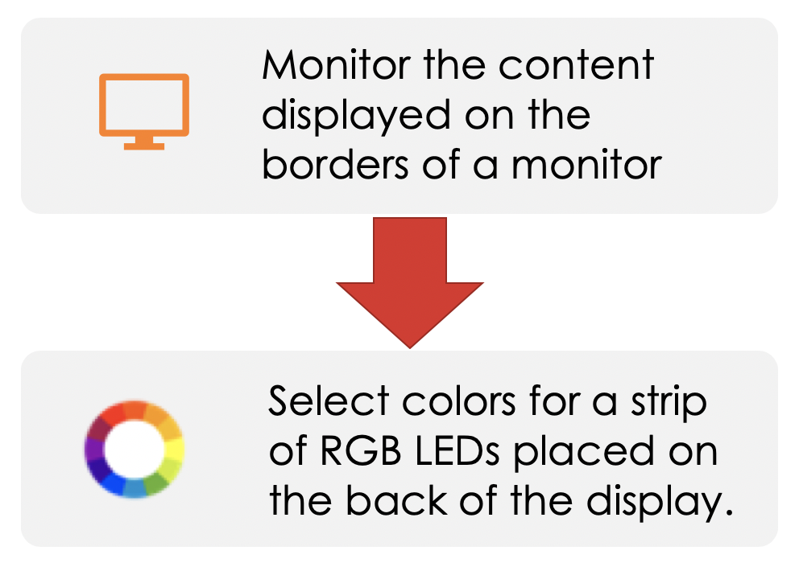
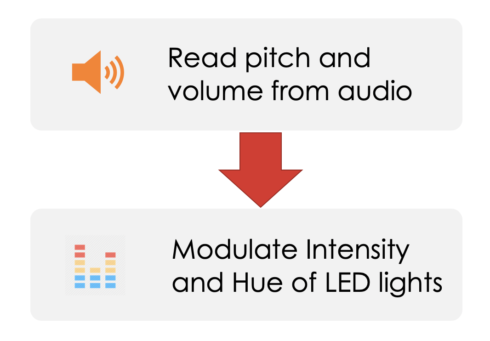
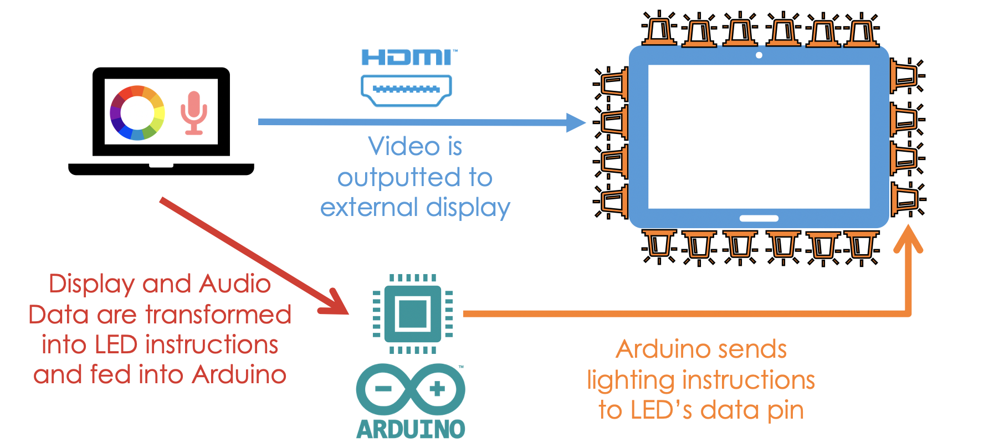

# Reactive-RGB LED Backlighting

## What is it?

A piece of software that makes color LEDs on the back of your display reactive to what you are doing.

The software is reactive to two things 
- Display
- Audio

## What will it do?

### Display Reactivity

This application can control the RGB lights on the back of your monitor so they display colors that match the display. 

### Sound Reactivity

This application can also modulate your LEDs based on the currently playing audio. 

## How does it work?

### Display Reactivity 

By monitoring the content displayed on a monitor border, we select colors for a strip of RGB LEDs placed on the back of the display.

### Sound Reactivity 

By reading pitch and volume data from your microphone, intensity and hue of LED strip colors can be modulated. 

### Hardware Configuration

### Important Note Before Trying it Out Yourself

Although the software is capable of extracting the data needed for LEDs, the software for the Arduino has **not** been completed. 
Instead, this repository bundles a simulation of the LEDs. 

## Requirements

### Software Requirements

- [Python 3.6](https://www.python.org/downloads/) 
- Python Modules
  - [PyAudio Python Module](https://people.csail.mit.edu/hubert/pyaudio/)
  - [Aubio](https://github.com/aubio/aubio)
  - [mss](https://python-mss.readthedocs.io/installation.html)
  - [PIL](https://pythonware.com/products/pil/)
  - [CV2](https://opencv-python-tutroals.readthedocs.io/en/latest/py_tutorials/py_setup/py_table_of_contents_setup/py_table_of_contents_setup.html)
  - [numpy](https://www.scipy.org/install.html)
  
- C#
  - .NET Framework 3.0+
- Visual Studio or a compatible IDE

### Hardware Requirements 

- QuadCore Processor @ 3 Ghz

- Memory: 8 GB RAM

- Microphone Input

### Recommended Hardware 

- Processor (AMD): AMD Ryzen 3 1300X

- Processor (Intel): Intel Core i7 4790 or equivalent

- Memory: 12 GB RAM

## Installation
- Clone the repository
- Within Form1.cs, replace pathPython and pathScript with your python.exe and clientcapture.py paths
- Run the application in Visual Studio or a compatible IDE
- In runtime, the numeric boxes representing the number of Vertical and Horizontal LEDs is a representation of just one side of the monitor, not combined. For example, 64 total LEDs placed vertically, means 32 on each side, so the inputted number should be 32 in the Vertical box.
- For multiple monitor displays, use the "Preview Monitor" option to view what the selected monitor is
- Press "Start" to begin
